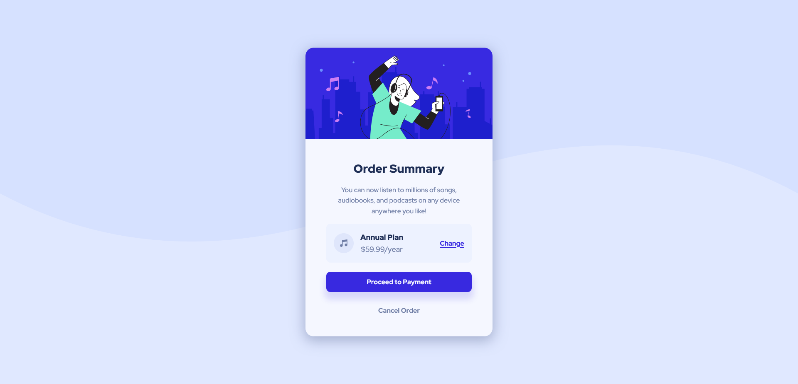

# Frontend Mentor - Order Summary Card Solution

This is a solution to the [Order summary card challenge on Frontend Mentor](https://www.frontendmentor.io/challenges/order-summary-component-QlPmajDUj).

## Table of contents

- [Overview](#overview)
  - [The challenge](#the-challenge)
  - [Screenshot](#screenshot)
  - [Links](#links)
- [My process](#my-process)
  - [Built with](#built-with)
  - [What I learned](#what-i-learned)
  - [Continued development](#continued-development)
  - [Useful resources](#useful-resources)
- [Author](#author)

## Overview

### The challenge

Users should be able to:

- See hover states for interactive elements

### Screenshot



### Links

- Solution URL: [GitHub](https://github.com/wesleyjacoby/Order-Summary-Component)
- Live Site URL: [GitHub Pages](https://wesleyjacoby.github.io/Order-Summary-Component/)

## My process

### Built with

- Semantic HTML5 markup
- CSS custom properties
- Flexbox

### What I learned

I struggled a lot more than I thought I would with the background image. I finally managed to get it right with this line of code:

```css
body {
    background-image: url(./images/pattern-background-desktop.svg);
    background-size: contain;
    background-repeat: no-repeat;
    background-position: top;
}
```

Particularly the `background-size: contain;` line.

I'm still struggling a bit with responsiveness though. To make the container reduce it's height while being resized, I used this line of code: `height: fit-content;` on the container class.

It was my first time using the box-shadow property.

### Continued development

I would like to continue practicing responsive development. Perhaps starting with the mobile design and working towards the desktop design. At the moment, I am building the other way around (desktop to mobile).

### Useful resources

- [Box Shadow](https://developer.mozilla.org/en-US/docs/Web/CSS/box-shadow) - This helped me understand the box-shadow property.
- [Basic Button Styling](https://www.w3schools.com/csS/css3_buttons.asp) - This helped me with the styling of the button element.

## Author

- Frontend Mentor - [@wesleyjacoby](https://www.frontendmentor.io/profile/wesleyjacoby)